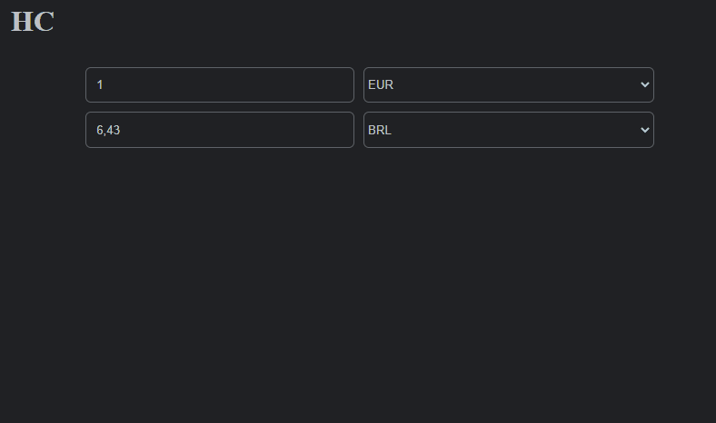

<div align="center">
	<h1>Hello Currency</h1>
</div>

## :camera: Demonstração



## :dart: Objetivo

Essa aplicação foi construida usando o React e o styked-components. Ela acessa a API [exchangerates](https://exchangeratesapi.io/) que fornece dados em tempo real das moedas assim que a aplicação é carregada.

## :hammer_and_wrench: Ferramentas

- [React](https://pt-br.reactjs.org/)
- [styked-components](https://styled-components.com/)
- [Express](https://expressjs.com/)
- [Node](https://nodejs.org/)
- [Yarn](https://yarnpkg.com/)

## :rocket: Executando o projeto

1.Clonando o repositório

```bash
git clone https://github.com/Felipefmv/dtmoney
```

2.Para instalar rode

```
yarn
```

3.Concluindo a instalação rode

```
yarn start
```

4.Acesse http://localhost:3000/
